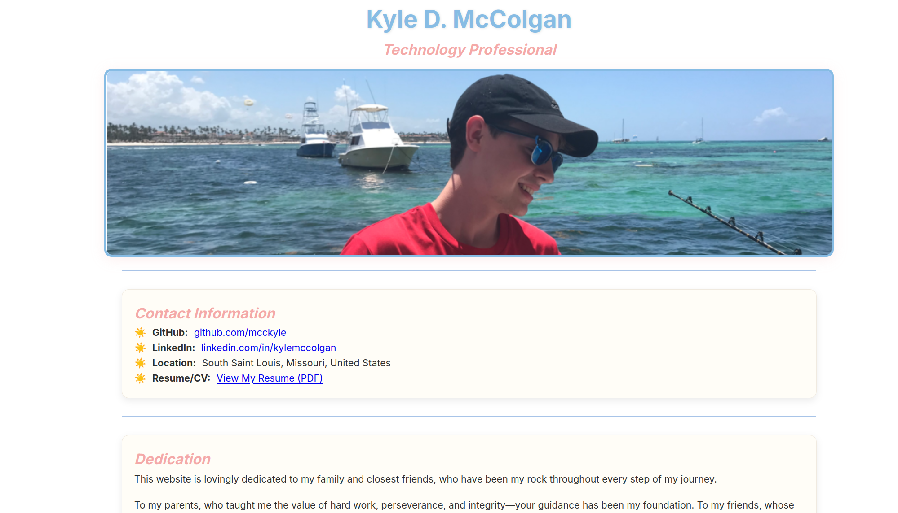

[](https://github.com/mcckyle/mcckyle.github.io/actions/workflows/autograding.yml)

# Kyle McColgan – Technology Professional

Welcome! 👋

This repository contains the source code for my personal website, designed to showcase my technical skills, projects, and journey in web development. Built with React, this site reflects my approach to creating user-friendly, and secure web solutions.

Feel free to explore my work, and as well as reach out if you're interested in collaborating, sharing insights, or discussing new ideas!


*A glimpse of my personal website, with a screenshot, designed to highlight my technology-related projects*

*🌐 [Visit the live site](https://mcckyle.github.io/)*

## Table of Contents

1. [About Me](#about-me)
2. [Technologies Used](#technologies-used)
3. [How to Use](#how-to-use)
4. [Project Structure](#project-structure)
5. [Future Plans](#future-plans)
6. [Tests](#tests)
7. [License](#license)
8. [Contact](#contact)
9. [Acknowledgements](#acknowledgements)


## About Me

Hello! My name is Kyle! I'm a technology professional and security enthusiast based in Saint Louis. I specialize in building custom, practical web solutions that prioritize both usability and security. My approach emphasizes streamlined user experiences alongside robust security practices, ensuring that the apps are not only efficient and scalable but also security-hardened.

I’m always eager to collaborate, exchange ideas, and tackle challenges with fellow tech enthusiasts! Whether it’s contributing to open-source projects, discussing emerging security trends, or elevating practical web solutions - let’s build something impactful together!!

## Technologies Used

- **Languages:** HTML, CSS, JavaScript, and React.
- **Build Tool** Vite, for rapid development and optimized production builds.
- **Testing Framework:** Jest, for unit testing the JavaScript functionality.
- **Deployment:** GitHub Pages, for free hosting and deployment.
- **Version Control:** Git, managed through GitHub.

## How to Use

Follow the steps below to run the site locally on your machine:

1. **Clone the repository:**

    ```bash
    git clone https://github.com/mcckyle/mcckyle.github.io.git
    cd mcckyle.github.io
    ```

2. **Install project dependencies:**

    Make sure you have [Node.js](https://nodejs.org/) installed. Then, install the required packages:

    ```bash
    npm install
    ```

3. **Start the development server:**

    Run the following command to start the local dev server:

    ```bash
    npm run dev
    ```

4. **View the site:**

    After the server starts, open your browser and navigate to:

    ```
    http://localhost:5173
    ```

    This will display the website running locally in development mode.

---


## Project Structure

```
mcckyle.github.io/
├── .git/                  # Git version control directory.
├── .github/               
│   └── workflows/
│       └── autograding.yml
│
├── public/                # Public assets.
│   └── index.html
│
├── src/                   # Source code for the React app.
│   ├── components/        # Reusable UI components.
│   │   ├── Header.js
│   │   ├── Skills.js
│   │   ├── Footer.js
│   │   ├── Projects.js
│   │   ├── Mission.js
│   │   ├── Dedication.js
│   │   ├── AboutMe.js
│   │   ├── Contact.js
│   │   └── History.js
│   │         
│   ├── App.jsx
│   ├── App.css
│   ├── main.jsx
│   ├── setupTests.js
│   ├── index.css          # Global styles.
│   └── styles.css
├── __tests__/             # Unit and integration tests.
│   ├── Header.test.js
│   ├── Skills.test.js
│   ├── Projects.test.js
│   ├── Mission.test.js
│   ├── Dedication.test.js
│   ├── AboutMe.test.js
│   ├── Contact.test.js
│   └── History.test.js
├── dist/                 # Production build output.
├── .gitignore            # Files and directories to ignore in Git.
├── babel.config.js
├── eslint.config.js
├── jest.config.cjs
├── vite.config.cjs
├── index.html
├── LICENSE
├── package.json          # Project metadata and dependencies.
└── README.md             # Project documentation.
```

## Future Plans

- **Enhanced Features:** Introduce dynamic, interactive components using JavaScript.
- **Security Upgrades:** Adopt advanced secure web development practices.
- **Project Showcase:** Add more projects highlighting C++ and security work.

## Tests

To ensure the quality and reliability of the website, this project utilizes the **Jest** testing framework. Unit tests are located in the `__tests__` directory and cover the key components of the app.

To run the tests locally, use the following command:

```bash
npm test
```

## License

This project is licensed under the **MIT License**. See the [LICENSE](LICENSE) file for more information.

## Contact

I'm always open to new opportunities, collaborations, or discussions about technology. Feel free to connect:

- **LinkedIn:** [Kyle McColgan](https://www.linkedin.com/in/kylemccolgan/)
- **GitHub:** [mcckyle](https://github.com/mcckyle)

Thank you for visiting my repository. I look forward to connecting!

## Acknowledgements

We would like to express our gratitude to the following:

- **React**: For providing the powerful library that powers the front-end of this project.
- **Node.js**: For providing the runtime environment that powers the server-side of the project.
- **GitHub Pages**: For hosting the repository and making collaboration possible.
- **Open Source Community**: For sharing knowledge and developing tools that benefit developers worldwide.


