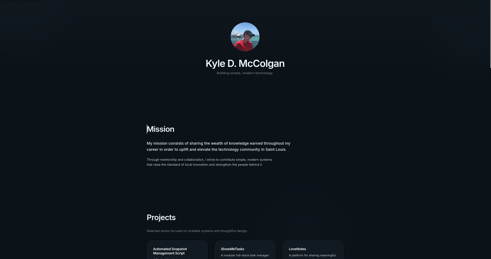

[](https://github.com/mcckyle/mcckyle.github.io/actions/workflows/autograding.yml)

# Kyle McColgan – Technology Professional

## Introduction

Welcome! 👋

This repository contains the source code for my personal website, designed to showcase my projects and journey in web development. Built with React, this site reflects my approach to creating simple and modern web designs.

Feel free to explore my work, as well as reach out if you're interested in collaborating!


*A glimpse of my website, captured with a screenshot.*

*🌐 [Visit the live site](https://mcckyle.github.io/)*

## Table of Contents

1. [Introduction](#introduction)
2. [Features](#features)
3. [Tech Stack](#tech-stack)
4. [Getting Started](#getting-started)
5. [Architecture](#architecture)
6. [Design Philosophy](#design-philosophy)
7. [Roadmap](#roadmap)
8. [License](#license)
9. [Contact](#contact)
10. [Acknowledgements](#acknowledgements)

## Features

- **Scalable, Modular Design** – Built with React, ensuring each component can grow without friction.
- **Seasonal Color Palettes** – Expect a fresh, seasonal palette every month.
- **Intuitive Interface** – Clean, minimal layouts prioritize clarity and usability, making every interaction smooth and predictable.
- **Responsive & Adaptive** – Fully optimized for all devices, with fluid layouts and readable typography at any screen size. 
- **Performance Focused** – Optimized for fast load times and minimal render overhead, enabling a snappy user experience.
- **Maintainable & Testable** – Modular code structure and integrated unit tests promote maintainability and confidence in production.

## Tech Stack

- **Languages:** HTML, CSS, JavaScript, React
- **Build Tool:** [Vite](https://vitejs.dev)
- **Testing:** [Jest](https://jestjs.io)
- **Deployment:** [GitHub Pages](https://pages.github.com/)
- **Version Control:** [Git](https://git-scm.com/)

## Getting Started

To run this project locally, follow the steps below:

1. **Clone the repository:**

    ```bash
    git clone https://github.com/mcckyle/mcckyle.github.io.git
    cd mcckyle.github.io
    ```

2. **Install project dependencies:**

    Make sure you have [Node.js](https://nodejs.org/) installed. Then, install the required packages:

    ```bash
    npm install
    ```

3. **Start the development server:**

    Run the following command to start the local dev server:

    ```bash
    npm run dev
    ```

4. **View the site:**

    After the server starts, open your browser and navigate to:

    ```
    http://localhost:5173
    ```

    This will display the website running locally in development mode.

---

## Architecture

```
mcckyle.github.io/
├── .git/                  # Git version control directory.
├── .github/               
│   └── workflows/
│       └── autograding.yml
│
├── public/                # Public assets.
│   └── images/            # Screenshots and favicons.
│
├── src/                   # Source code for the React app.
│   ├── components/        # Reusable UI components.
│   │   ├── Header/
│   │   │   ├── Header.jsx
│   │   │   └── Header.css
│   │   │
│   │   ├── Mission/
│   │   │   ├── Mission.jsx
│   │   │   └── Mission.css
│   │   │
│   │   ├── Projects/
│   │   │   ├── Projects.jsx
│   │   │   └── Projects.css
│   │   │
│   │   ├── Skills/
│   │   │   ├── Skills.jsx
│   │   │   └── Skills.css
│   │   │
│   │   ├── AboutMe/
│   │   │   ├── AboutMe.jsx
│   │   │   └── AboutMe.css
│   │   │
│   │   ├── Experience/
│   │   │   ├── Experience.jsx
│   │   │   └── Experience.css
│   │   │
│   │   ├── Contact/
│   │   │   ├── Contact.jsx
│   │   │   └── Contact.css
│   │   │
│   │   └── Footer/
│   │       ├── Footer.jsx
│   │       └── Footer.css
│   │
│   ├── App.jsx
│   ├── App.css
│   ├── main.jsx
│   ├── index.css          # Global styles.
│   └── styles/
│       ├── base.css
│       ├── layout.css
│       ├── utilities.css
│       └── animations.css
│
├── __tests__/             # Jest unit tests.
│   ├── Header.test.js
│   ├── Mission.test.js
│   ├── Projects.test.js
│   ├── Skills.test.js
│   ├── AboutMe.test.js
│   ├── Experience.test.js
│   ├── Contact.test.js
│   └── Footer.test.js
│
├── dist/                 # Production build output.
├── .gitignore            # Files and directories to ignore in Git.
├── babel.config.js
├── eslint.config.js
├── vite.config.js
├── jest.config.cjs
├── index.html
├── package-lock.json
├── package.json          # Project metadata and dependencies.
├── LICENSE
└── README.md             # Project documentation.
```

## Design Philosophy

This project is built with **intention and simplicty** at its core:

- **Minimalism with Purpose** – Every element has meaning; no visual clutter or redundant features.
- **Consistency & Readability** – Typography, spacing, and color usage are harmonious across all components, reflecting a cohesive brand presence.
- **User-Centered Thinking** – Interfaces anticipate user needs, emphasizing accessibility and smooth interactions.
- **Modern Standards** – Leveraging latest React patterns and responsive design practices.
- **Intentional Performance** – Lightweight, maintainable code ensures fast loading and smooth execution, even on constrained devices.
- **Future-Proof Architecture** – Designed for scalability and maintainability as the project grows.

## Roadmap

- **Enhanced Features:** Introduce dynamic, interactive components using JavaScript.
- **Security Upgrades:** Adopt advanced secure web development practices.
- **Project Showcase:** Add more projects highlighting C++ and security work.

## License

This project is licensed under the **MIT License**. See the [LICENSE](LICENSE) file for more information.

## Contact

I'm always open to new opportunities and collaborations.

Feel free to connect with me:

- [**LinkedIn:**](https://www.linkedin.com/in/kylemccolgan/) - Kyle McColgan
- [**GitHub:**](https://github.com/mcckyle) - @mcckyle

Thank you for visiting this repository. I look forward to connecting!!

## Acknowledgements

This project was made possible thanks to the following:

- [**React**](https://reactjs.org/) - for the intuitive front-end library.
- [**Node.js**](https://nodejs.org/) -  for the powerful and robust runtime environment.
- [**GitHub Pages**](https://pages.github.com/) - for providing free and reliable static site hosting.
- The **Open Source Community** - for generously sharing the tools and knowledge that enable this technology.
