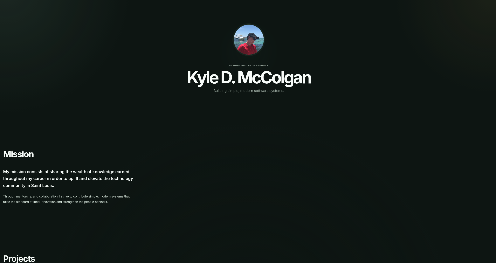

[](https://github.com/mcckyle/mcckyle.github.io/actions/workflows/autograding.yml)

# Kyle McColgan – Technology Professional

A personal portfolio built with React and Vite, focused on simple interfaces and modern engineering practices.


*A glimpse of my website, captured with a screenshot.*

*🌐 [Live site](https://mcckyle.github.io/)*

## Table of Contents

1. [Features](#features)
2. [Tech Stack](#tech-stack)
3. [Getting Started](#getting-started)
4. [Architecture](#architecture)
5. [Design Philosophy](#design-philosophy)
6. [Deployment](#deployment)
7. [License](#license)
8. [Contact](#contact)
9. [Acknowledgements](#acknowledgements)

## Features

- **Seasonal themes** – A fresh visual system that evolves throughout the year.
- **Responsive design** – Fluid layouts and typography adapts across all screen sizes. 
- **Accessible by default** – Semantic HTML, keyboard navigation, focus states, reduced-motion support, and responsive presentation.
- **Component-driven architecture** – Each section is isolated into focused React components with dedicated styles and tests.
- **Performance-minded** – Lightweight CSS, minimal dependencies, optimized assets, and Vite's production build pipeline.
- **Maintainable styling** – Shared layout primitives, design tokens, reusable surfaces, and seasonal theme layers keep the visual system cohesive.

## Tech Stack

- **Frontend:** React, JavaScript, HTML, CSS
- **Build:** [Vite](https://vitejs.dev)
- **Testing:** [Vitest](https://vitest.dev/)
- **Deployment:** [GitHub Pages](https://pages.github.com/)
- **Version Control:** [Git](https://git-scm.com/)

## Getting Started

To run this project locally, follow the steps below:

1. **Clone the repository:**

    ```bash
    git clone https://github.com/mcckyle/mcckyle.github.io.git
    cd mcckyle.github.io
    ```

2. **Install project dependencies:**

    Make sure you have [Node.js](https://nodejs.org/) installed. Then, install the required packages:

    ```bash
    npm install
    ```

3. **Start the development server:**

    Run the following command to start the local dev server:

    ```bash
    npm run dev
    ```

4. **View the site:**

    After the server starts, open your browser and navigate to:

    ```
    http://localhost:5173/
    ```

    This will display the website running locally in development mode.

---

## Architecture

```
mcckyle.github.io/
├── .git/                  # Git version control directory.
├── .github/               
│   └── workflows/
│       └── autograding.yml
│
├── public/                # Public assets.
│   └── images/            # Screenshots and favicons.
│
├── src/                   # Source code for the React app.
│   ├── components/        # Reusable UI components.
│   │   ├── Header/
│   │   │   ├── Header.jsx
│   │   │   └── Header.css
│   │   │
│   │   ├── Mission/
│   │   │   ├── Mission.jsx
│   │   │   └── Mission.css
│   │   │
│   │   ├── Projects/
│   │   │   ├── Projects.jsx
│   │   │   └── Projects.css
│   │   │
│   │   ├── Skills/
│   │   │   ├── Skills.jsx
│   │   │   └── Skills.css
│   │   │
│   │   ├── AboutMe/
│   │   │   ├── AboutMe.jsx
│   │   │   └── AboutMe.css
│   │   │
│   │   ├── Experience/
│   │   │   ├── Experience.jsx
│   │   │   └── Experience.css
│   │   │
│   │   ├── Contact/
│   │   │   ├── Contact.jsx
│   │   │   └── Contact.css
│   │   │
│   │   └── Footer/
│   │       ├── Footer.jsx
│   │       └── Footer.css
│   │
│   ├── App.jsx
│   ├── App.css
│   ├── main.jsx
│   ├── index.css          # Global styles.
│   ├── themes/            # Seasonal monthly styles.
│   └── styles/
│       ├── base.css
│       ├── layout.css
│       ├── animations.css
│       └── utilities.css
│
├── __tests__/             # Vitest unit tests.
│   ├── Header.test.jsx
│   ├── Mission.test.jsx
│   ├── Projects.test.jsx
│   ├── Skills.test.jsx
│   ├── AboutMe.test.jsx
│   ├── Experience.test.jsx
│   ├── Contact.test.jsx
│   └── Footer.test.jsx
│
├── dist/                 # Production build output.
├── .gitignore            # Files and directories to ignore in Git.
├── eslint.config.js
├── vite.config.js
├── index.html
├── package-lock.json
├── package.json          # Project metadata and dependencies.
├── LICENSE
└── README.md             # Project documentation.
```

## Design Philosophy

The site follows a simple principle: **the content should be the feature**.

The visual system emphasizes:

- restrained typography
- generous whitespace
- accessible contrast and interaction
- subtle atmospheric backgrounds
- reusable design primitives
- seasonal color without seasonal clutter
- progressive enhancement rather than unnecessary complexity

Each monthly theme changes the visual character of the site while preseving the same underlying structure and interaction patterns.

## Deployment

The site is built with Vite and deployed through GitHub Pages using GitHub Actions.

## License

This project is licensed under the **MIT License**. See the [LICENSE](LICENSE) file for more information.

## Contact

You can reach me in the following ways:

- [**GitHub:**](https://github.com/mcckyle) - @mcckyle
- [**LinkedIn:**](https://www.linkedin.com/in/kylemccolgan/) - Kyle McColgan

## Acknowledgements

This project was made possible thanks to the following:

- [**React**](https://reactjs.org/) - for the intuitive front-end library.
- [**Node.js**](https://nodejs.org/) - for the powerful and robust runtime environment.
- [**GitHub Pages**](https://pages.github.com/) - for providing free and reliable static site hosting.
- The **Open Source Community** - for generously sharing the tools and knowledge that enable this technology.
