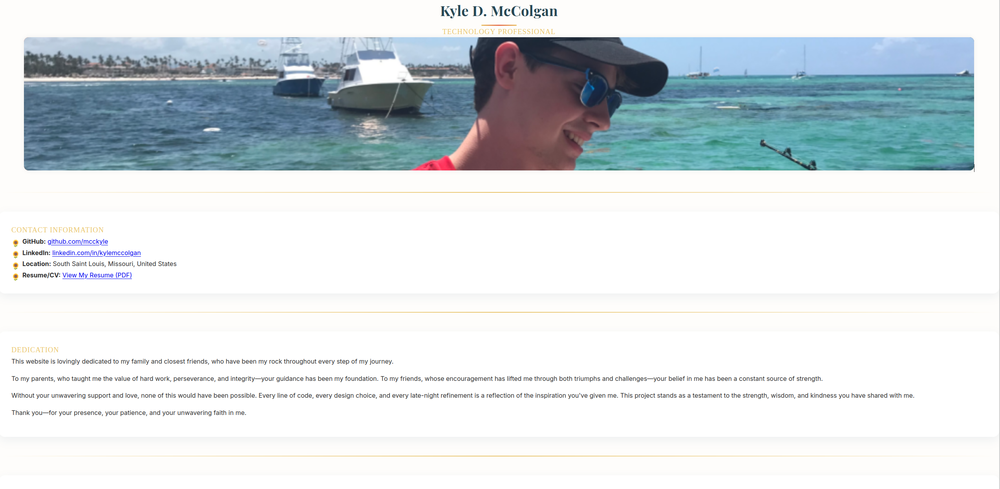

[](https://github.com/mcckyle/mcckyle.github.io/actions/workflows/autograding.yml)

# Kyle McColgan – Technology Professional

## Overview

Welcome! 👋

This repository contains the source code for my personal website, designed to showcase my technical skills, projects, and journey in web development. Built with React, this site reflects my approach to creating user-friendly and accessible web solutions.

Feel free to explore my work, and as well as reach out if you're interested in collaborating, sharing insights, or discussing new ideas!


*A glimpse of my personal website, with a screenshot, designed to summarize my technology related projects*

*🌐 [Visit the live site](https://mcckyle.github.io/)*

## Table of Contents

1. [Overview](#overview)
2. [Technologies Used](#technologies-used)
3. [How to Use](#how-to-use)
4. [Project Structure](#project-structure)
5. [Future Plans](#future-plans)
6. [Tests](#tests)
7. [License](#license)
8. [Contact](#contact)
9. [Acknowledgements](#acknowledgements)

## Technologies Used

- **Languages:** HTML, CSS, JavaScript, React.
  For building responsive, interactive, and dynamic web interfaces.
  
- **Build Tool** [Vite](https://vitejs.dev)
  Enables rapid development with optimized production builds.
  
- **Testing:** [Jest](https://jestjs.io)
  Used for writing and running the unit tests for the JavaScript functionality.
  
- **Deployment:** [GitHub Pages](https://pages.github.com/)
  Provides free hosting and deployment directly from the repository.
  
- **Version Control:** [Git](https://git-scm.com/)
  For source control, collaboration, and code management.

## How to Use

To run this project locally, follow the steps below:

1. **Clone the repository:**

    ```bash
    git clone https://github.com/mcckyle/mcckyle.github.io.git
    cd mcckyle.github.io
    ```

2. **Install project dependencies:**

    Make sure you have [Node.js](https://nodejs.org/) installed. Then, install the required packages:

    ```bash
    npm install
    ```

3. **Start the development server:**

    Run the following command to start the local dev server:

    ```bash
    npm run dev
    ```

4. **View the site:**

    After the server starts, open your browser and navigate to:

    ```
    http://localhost:5173
    ```

    This will display the website running locally in development mode.

---


## Project Structure

```
mcckyle.github.io/
├── .git/                  # Git version control directory.
├── .github/               
│   └── workflows/
│       └── autograding.yml
│
├── public/                # Public assets.
│   └── index.html
│
├── src/                   # Source code for the React app.
│   ├── components/        # Reusable UI components.
│   │   ├── Header.js
│   │   ├── Skills.js
│   │   ├── Footer.js
│   │   ├── Projects.js
│   │   ├── Mission.js
│   │   ├── Dedication.js
│   │   ├── AboutMe.js
│   │   ├── Contact.js
│   │   └── History.js
│   │         
│   ├── App.jsx
│   ├── App.css
│   ├── main.jsx
│   ├── setupTests.js
│   ├── index.css          # Global styles.
│   └── styles.css
├── __tests__/             # Unit and integration tests.
│   ├── Header.test.js
│   ├── Skills.test.js
│   ├── Projects.test.js
│   ├── Mission.test.js
│   ├── Dedication.test.js
│   ├── AboutMe.test.js
│   ├── Contact.test.js
│   └── History.test.js
├── dist/                 # Production build output.
├── .gitignore            # Files and directories to ignore in Git.
├── babel.config.js
├── eslint.config.js
├── vite.config.js
├── jest.config.cjs
├── index.html
├── package-lock.json
├── package.json          # Project metadata and dependencies.
├── LICENSE
└── README.md             # Project documentation.
```

## Future Plans

- **Enhanced Features:** Introduce dynamic, interactive components using JavaScript.
- **Security Upgrades:** Adopt advanced secure web development practices.
- **Project Showcase:** Add more projects highlighting C++ and security work.

## Tests

To ensure the quality and reliability of the website, this project utilizes the **Jest** testing framework. Unit tests are located in the `__tests__` directory and cover the key components of the app.

To run the tests locally, use the following command:

```bash
npm test
```

## License

This project is licensed under the **MIT License**. See the [LICENSE](LICENSE) file for more information.

## Contact

I'm always open to new opportunities, collaborations, or thoughtful discussions about technology.

Feel free to connect with me:

- [**LinkedIn:**](https://www.linkedin.com/in/kylemccolgan/) - Kyle McColgan
- [**GitHub:**](https://github.com/mcckyle) - @mcckyle

Thank you for visiting this repository. I look forward to connecting!!

## Acknowledgements

Special thanks to the technologies and communities that made this project possible:

- [**React**](https://reactjs.org/) - for providing the intuitive library that powers the front-end of this project.
- [**Node.js**](https://nodejs.org/) -  for providing the runtime environment that powers the server-side of the project.
- [**GitHub Pages**](https://pages.github.com/) - for the free and reliable static site hosting.
- The **Open Source Community** - for generously sharing tools, libraries, and knowledge that fuel innovation and collaboration.
